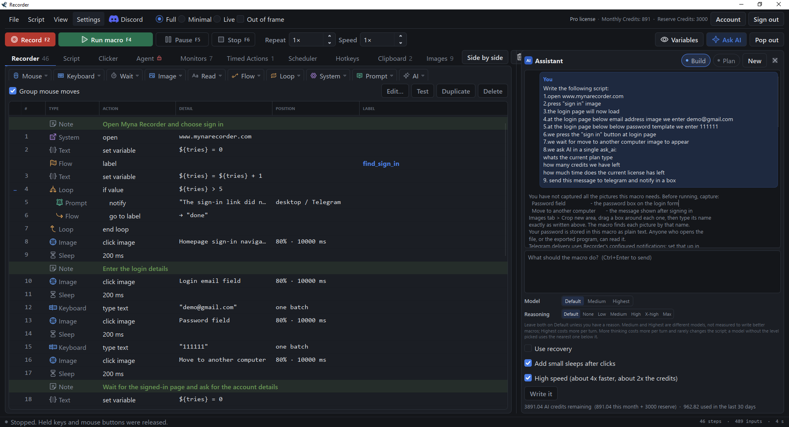
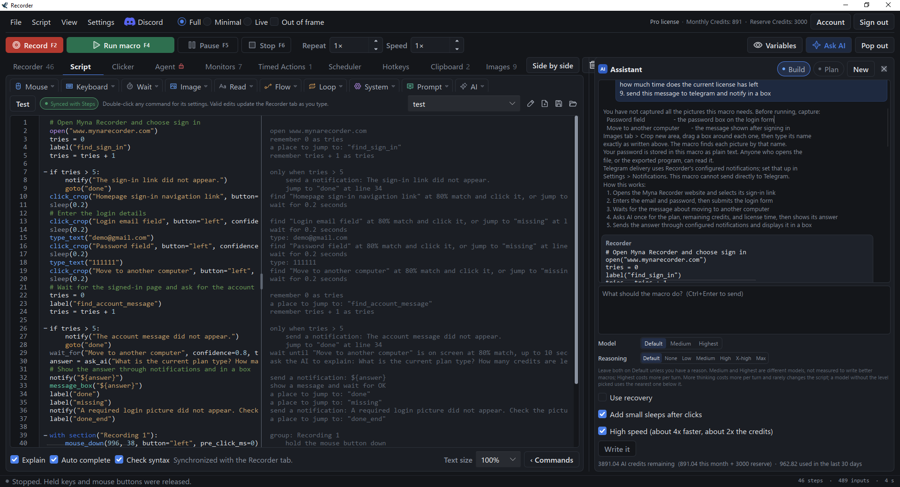
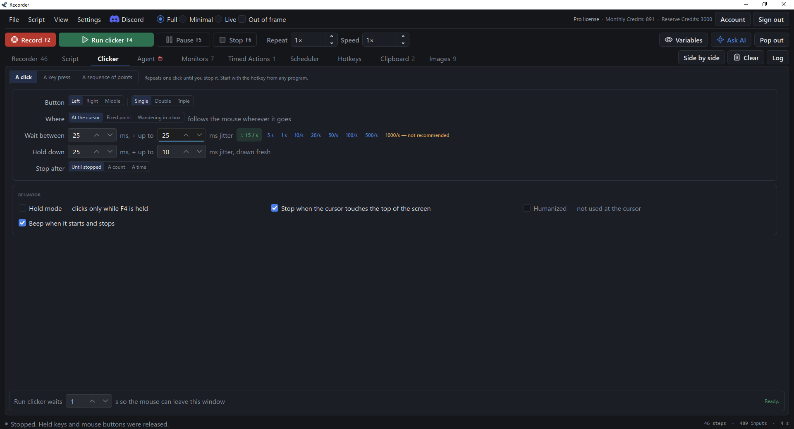
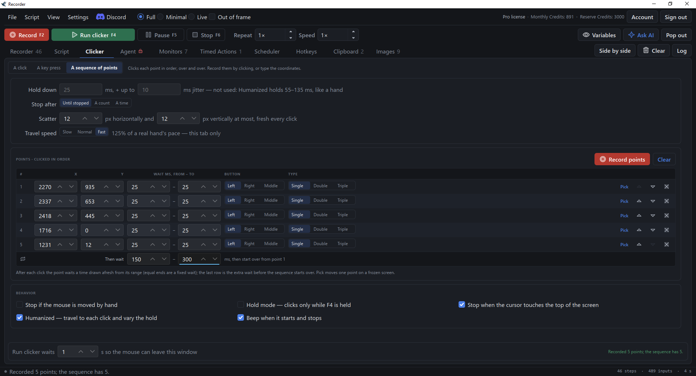
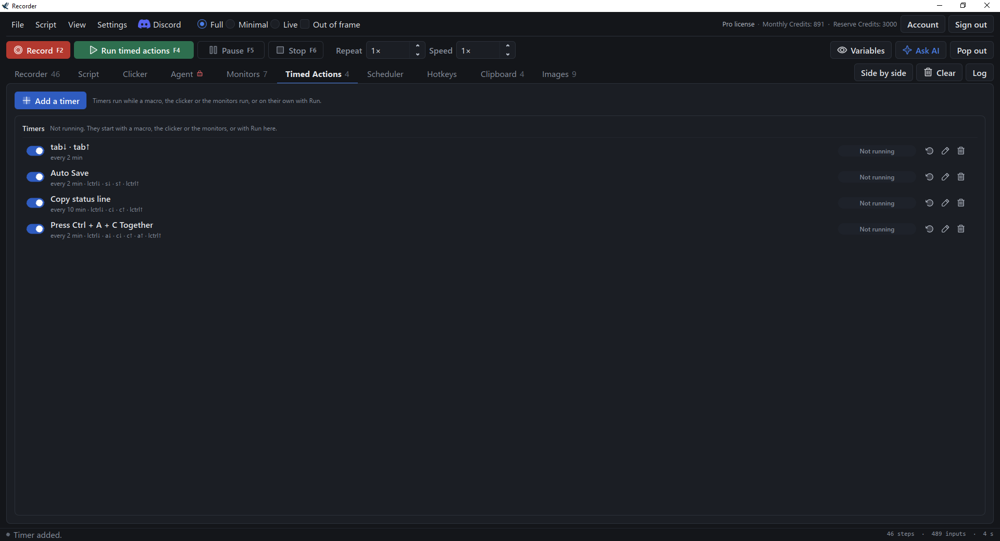
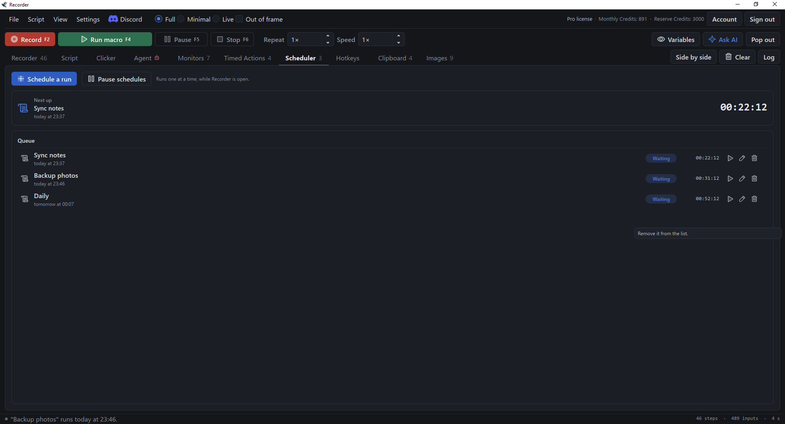
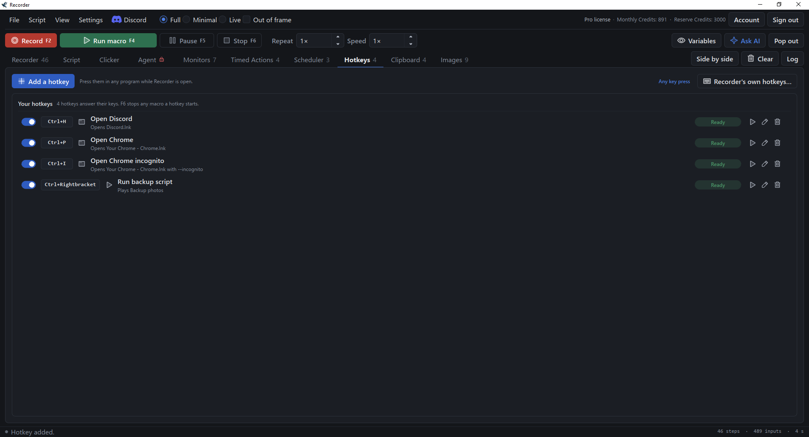
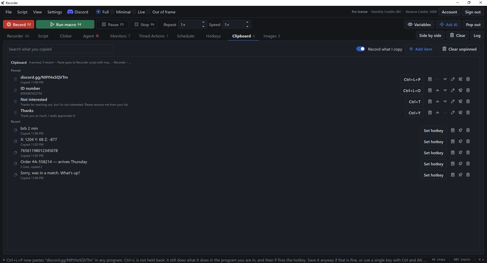
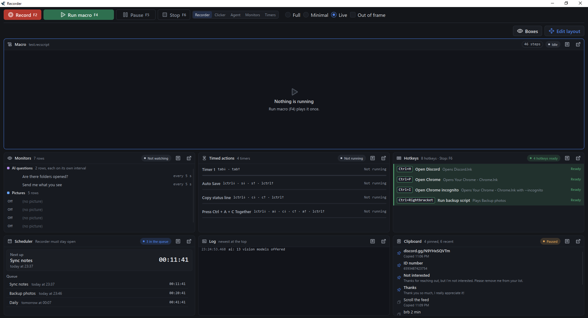
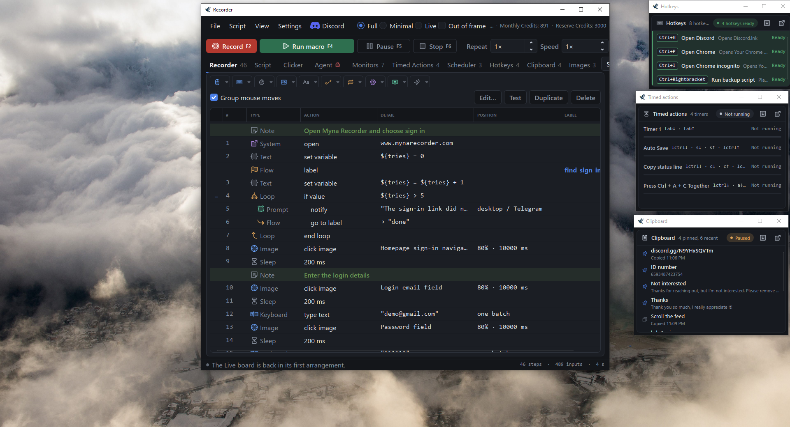

# Myna Recorder

**A macro recorder for Windows that you can actually read and edit.**

Record what you do, edit it as a plain script, and run it whenever you like.
It finds things on screen by picture, so it keeps working when a window moves.

Every tab, three seconds each. The stills are below.

---

## See it in action

<b>Myna Recorder | AI Assistant</b>, on YouTube

## What it does

| | |
|---|---|
| **Record and replay** | Keyboard and mouse, with your original timing. Replay from 0.25× to 10×, or on repeat. |
| **Edit as a readable script** | The same macro as a step list or as text, kept in sync both ways. Loops, conditions, variables and functions, with a plain-English explanation beside every line. |
| **Image anchors** | Wait for a picture on screen, or click it. The macro survives a moved window, a new resolution, another machine. |
| **Read text from the screen** | Pull an order number, a total or a filename into a variable. Two readers run on your computer; a third asks the AI. |
| **AI assistant** | Describe the macro in plain English and get a script back. Nothing reaches your editor until you approve it. |
| **Screen watchdog** | Monitors watch for a picture, or ask the AI a question, while a macro runs or on their own. They pop up, message Telegram or Discord, film the screen, run a saved script, or stop the run. |
| **Telegram and Discord** | Alerts from monitors and from your macros, and control from a chat: run, pause or stop Recorder and get a screenshot. |
| **Screen video and screenshots** | Film the screen around a monitor event, starting a few seconds before it. Take screenshots or record video from a script or a hotkey: a whole screen, a window, a region, or a box you drag. |
| **Color matching** | Wait for a color on screen or click it, and match pictures by color, by shape, or through a color mask. |
| **Crop burst** | Keep photographing an area for a few seconds, then flip through the pictures and crop as many as you need. |
| **Auto clicker** | One click or one key, over and over, up to 1,000 a second: at the cursor, at a point, in a box, or through a sequence of points you record by clicking them, at the pace you clicked. Jitter, scatter, hold mode, a count or a time limit. |
| **Humanized movement** | The pointer travels to each click the way a real hand does, in macros and in the clicker. |
| **Scheduler** | Start a saved macro at a date and time you choose, once or repeating at an interval. Scheduled runs wait their turn, one after another, while Recorder is open. |
| **Timed Actions** | Key presses, clicks and waits that repeat on a timer, alongside a macro, the clicker or the monitors, or on their own. |
| **Window commands** | Bring a program's window to the front, wait for it, move, resize, maximize, minimize or close it, found by its title. |
| **Export as a program** | Write a macro out as one .exe that runs on any Windows PC, with its image crops and the local text readers built in. |
| **Your own hotkeys** | Key combinations that open a program or a website, or play a macro, from any program. |
| **Clipboard history** | Keep what you copy, pin the items you reuse, and paste them with a hotkey. |
| **Live view** | One board for everything that is running: the macro, the monitors, the timers, the hotkeys, the schedule, the clipboard and the log. Arrange it your way, or float any box in a window of its own. |
| **Global hotkeys** | <kbd>F2</kbd> to record, <kbd>F4</kbd> to run, <kbd>F5</kbd> to pause and <kbd>F6</kbd> to stop, from any program. Run starts whatever the open tab is about: the macro, the clicker, the monitors or the timed actions. Every key can be changed. |

## Screens

<table>
  <tr>
    <td align="center" width="50%"> <b>Recorder</b>: every step as a row, in sections</td>
    <td align="center" width="50%"> <b>Script</b>: the same macro as text, with the AI assistant beside it</td>
  </tr>
  <tr>
    <td align="center" width="50%"> <b>Auto clicker</b>: one click at a set rate, with jitter on the wait and the hold</td>
    <td align="center" width="50%"> <b>Sequence of points</b>: clicked in order, each with its own wait</td>
  </tr>
  <tr>
    <td align="center" width="50%"> <b>Timed Actions</b>: keys and clicks that repeat on a timer</td>
    <td align="center" width="50%"> <b>Scheduler</b>: saved macros at a date and time, one after another</td>
  </tr>
  <tr>
    <td align="center" width="50%"> <b>Hotkeys</b>: your own key combinations, from any program</td>
    <td align="center" width="50%"> <b>Clipboard</b>: what you copied, with pinned items and hotkeys to paste them</td>
  </tr>
  <tr>
    <td align="center" colspan="2"> <b>Live view</b>: everything that is running, on one board</td>
  </tr>
  <tr>
    <td align="center" colspan="2"> <b>Floating boxes</b>: any Live box in a window of its own, beside your work</td>
  </tr>
  <tr>
    <td align="center" colspan="2"> <b>Monitors</b>: rows that fire on a picture or an AI answer and alert Telegram or Discord</td>
  </tr>
</table>

## Getting started

1. **Download and install.** Get the installer from [mynarecorder.com/download](https://mynarecorder.com/download), or the standalone `Myna Recorder.exe`, which runs from anywhere without installing.
2. **Sign in, or continue without an account.** Without an account you can record, edit and replay straight away. A [free account](https://mynarecorder.com/register) adds a 7-day trial of the paid features and keeps you signed in.
3. **Record something, or describe it.** Press record and do the task. With the AI assistant, you can type what you want and let it write the macro.
4. **Run it.** Replay it whenever you need, at the speed and repeat count you choose.

Windows may show "Windows protected your PC" the first time you run it. Choose **More info**, then **Run anyway**.

## Plans

Recording, editing, replay, image anchors and the auto clicker are free, with no account needed. For everything else, see the **[pricing page](https://mynarecorder.com/pricing)**.

## Requirements

- Windows 10 or Windows 11, 64-bit
- In 12 languages: English, German, Spanish, French, Italian, Portuguese (Brazil), Polish, Russian, Chinese (Simplified), Japanese, Korean and Arabic. Change it any time in Settings, General.
- An 84 MB installer, or an 82 MB standalone .exe that runs without installing.
- An internet connection for signing in and for the AI features. Recording, playback, image anchors, the local text readers and the auto clicker work offline.

## Documentation and help

- **[User manual](https://mynarecorder.com/manual)**: recording, playback, editing, image anchors, screen text, the assistant, monitors, the auto clicker, the Scheduler, Timed Actions, export and settings
- **[Changelog](https://mynarecorder.com/changelog)**: what changed in each release
- **[Discord](https://discord.gg/N9YHxSQVTm)**: help with macros, bug reports and announcements
- **[Issues](../../issues)**: bug reports and feature requests
- **support@mynarecorder.com**

Myna Recorder is free to download and use on the Free plan. It is not open source; this repository holds the issue tracker. Downloads are on [mynarecorder.com](https://mynarecorder.com/download).
